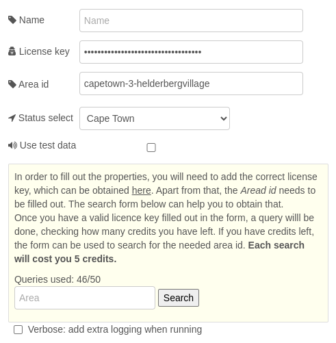

### EskomSePush API


A node for retrieving info from the [EskomSePush API](https://eskomsepush.gumroad.com/l/api).

The EskomSePush-API node makes it easier for South African users to incorporate the load shedding schedules into their flows.

### Summary

The node must be configured by entering the license key and the correct area id (which needs to fetched from the API).

Once deployed, the node will fetch the data from EskomSePush every hour. As every fetch from the API takes 2 calls, the 50 free queries per day on a free account should suffice. Every ten minutes the API status is checked to see how many queries you have left.

Internally, the node checks every minute if a schedule is currently active or not. It will also output a message on the first deployment.


The node has been made to work well together with the [@victronenergy/node-red-contrib-victron](https://flows.nodered.org/node/@victronenergy/node-red-contrib-victron) nodes. The ESS control node for setting the Minimum State of Charge is an obvious combination to enable a user to change the MinSoC value based on the currently active loadshedding stage.

You can find the example flow for this via importing the [victron-minsoc-stage-based.json](examples/victron-minsoc-stage-based.json) file.

### Configuration

First you will need a _licence key_. You can get one from [here](https://eskomsepush.gumroad.com/l/api), by subscribing to the Free model. Note that this is for personal use only.



Next you need to insert the correct area id.  This can be done by either:

* making a manual API call to search for the area and paste the id from the API response into the area field in the node; or
* by first entering a valid API license key into the node, and then entering at least 5 characters, the node will use the API to search for the area. Note that this will consume some of the daily API quota.

If you don't want to use API quota by searching, and you already know the id of the area, fill out the area first and then the license key.

To fetch the area id manually, make an `areas_search` API call using your API license key `token`, a word of search `text`.  In the response returned by the API, copy the `id` value of the matching area.

In the example below (on MacOS), `curl` is used to query the API and the search text value is 'ballito' (the license key token is invalid and must be replaced with a valid key).  The area id value that will be used from this example is `eskmo-15-ballitokwadukuzakwazulunatal`:

```
% curl --location --request GET 'https://developer.sepush.co.za/business/2.0/areas_search?text=ballito' --header 'token: 2DFB82AC-46254F6E-A68B26A4-8DF1303E'
{
  "areas":[
      {"id":"eskmo-15-ballitokwadukuzakwazulunatal","name":"Ballito (15)","region":"Eskom Municipal, Kwadukuza, Kwazulu-Natal"},
      {"id":"eskdo-15-ballitokwadukuzakwazulunatal","name":"Ballito (15)","region":"Eskom Direct, KwaDukuza, KwaZulu-Natal"}
   ]
}
```

Then you need to fill out which status to follow. This can be either _National_ (Eskom) or _Cape Town_.

If the _test_ checkbox has been selected, test data for the specified area will be fetched instead of the actual schedule. This is useful when debugging.

### Outputs

The note has two outputs. In most cases, the first (upper) output will be used.

The first output of the node outputs a boolean value and some related data. When load shedding is active, the `msg.payload` will be _true_, otherwise it will be _false_. It also outputs some extra values:

```
{
  "payload":false,
  "LoadShedding":{
    "schedule":{
       "next":{
         "start":1683561600000,
         "end":1683570600000,
         "type":"schedule"
       },
       "active":false
    },
    "event":{
      "next":{
        "start":1683561600000,
        "end":1683570600000
      },
      "active":false
    },
    "checked":"13:35",
    "next":{
      "start":1683561600000,
      "end":1683570600000,
      "type":"schedule"
    },
    "active":false
  },
  "stage":"5",
  "statusselect":"capetown",
  "api":{
    "count":12,
    "limit":50,
    "lastStatusUpdate":"Mon May 08 2023 13:34:30 GMT+0200 (Central European Summer Time)",
    "lastScheduleUpdate":"Mon May 08 2023 13:34:30 GMT+0200 (Central European Summer Time)"
  },
  "\_msgid":"6e77b593b7f9eda4"
}
```

The start and end objects contain the time of next load shedding period as unix timestamps in the Javascript format (milliseconds after the epoch).

The second output shows `msg.stage` and `msg.schedule`, containing the latest information as retrieved from the API. This output is mainly useful when writing your own functions and logic.

### Status

The status will show the situation regarding the API calls and when the next
shedding wil start or end.  It also shows the count of API calls that have been
done and how many are left. This updates every 10 minutes.

### Documentation

Documentation for the API can be found [here](https://documenter.getpostman.com/view/1296288/UzQuNk3E)

When quota has been exceeded:

```
{"error":"Quota Exceeded - Reminder: you can use the 'test' query param for development. Check the docs! \ud83d\ude05"}
```
